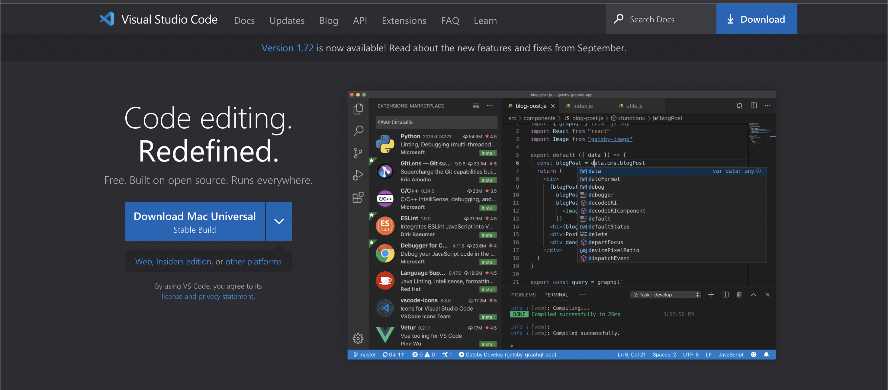
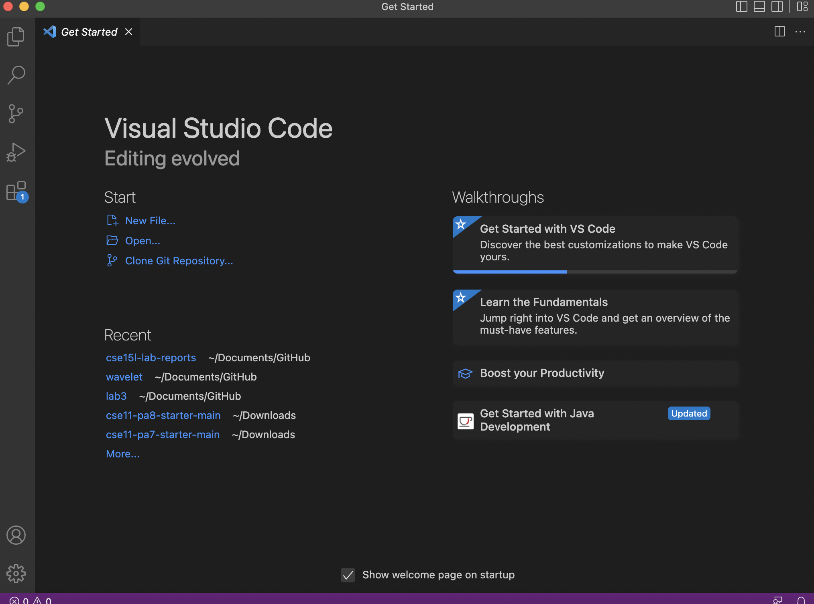
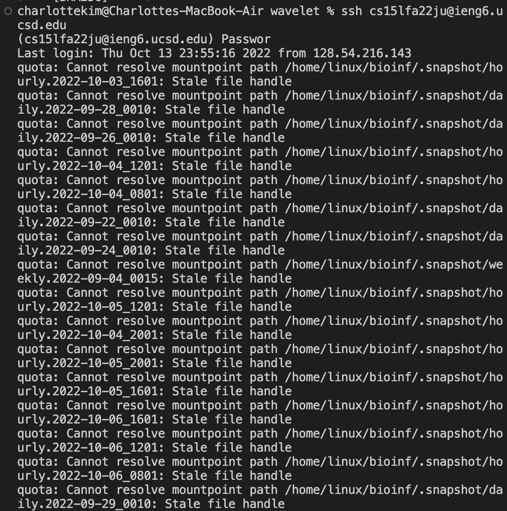
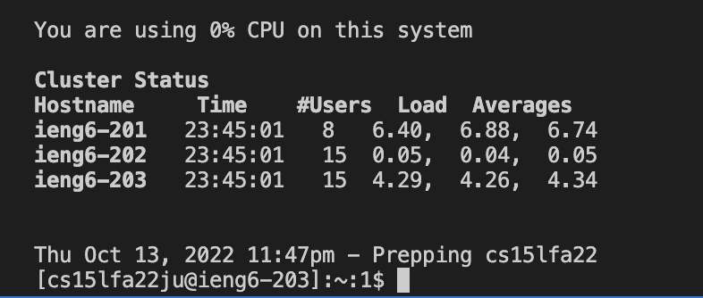
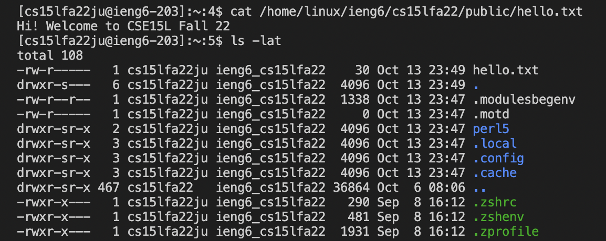
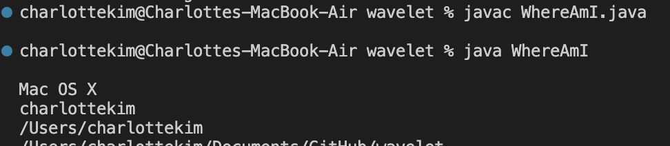
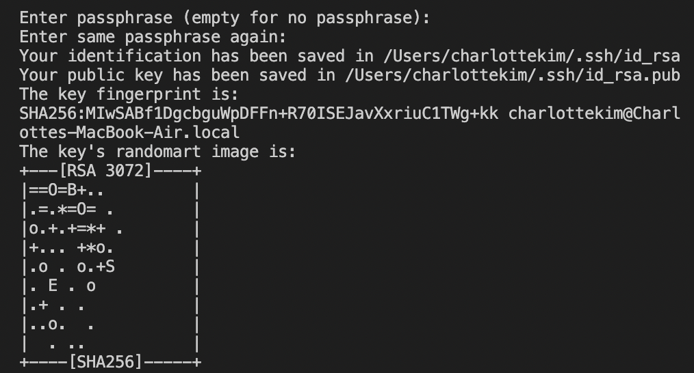
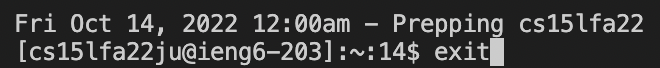

# **Remote Access**

In this lab report, I will be demostrating the process for logging into a remote computer and running commands (and some tips to make this process easier).

## **Installing VS Code**

First things first, we have to download and install Visual Studio Code. In order to do so, you have to click the download button (or the arrow next to it to find the version you need for your computer). Once you follow the instructions for installation, you should get something like this: 

## **Connecting Remotely**

To connect remotely, you need to log in to your remote account. In order to do so, type ssh cs15lfa22zz@ieng6.ucsd.edu (replace zz with the letters unique to you). Mine is ju. It will prompt you with a password. Once you log in, you should expect to either see what's below if you has previous failed log ins or the second photo.

## **Running Some Commands**

Below are some commands I tried (cat path and ls -lat).

## **Moving files over SSH with SCP**

I first tested the WhereAmI.java file on my computer:

To transfer the file to my remote computer, I typed ssh cs15lfa22ju@ieng6.ucsd.edu. When I tested the file on my remote account, I got the same result as above.     

## **Setting an SSH Key**

In order to set an ssh key, I typed ssh-keygen. I then set a passphrase and got the following below. 

## **Optimizing Remote Running**

One of the ways I optimized remote running (besides the SSH key) was using the up and down arrows to get the commands I typed previously so I could run them again. This is a trick I've used since I've learned to code (below is me using the up arrow key to get the exit command back).

