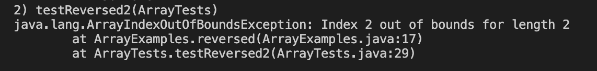

# **Week 3 Lab Report**

## **Part 1**

Below is the code for the Simplest Search Engine:

```
# code block
import java.io.IOException;
import java.net.URI;

class Handler implements URLHandler {
    String str = "";

    public String handleRequest(URI url) {
        if (url.getPath().equals("/")) {
            return String.format("String: %s", str);
        } else {
            System.out.println("Path: " + url.getPath());
            if (url.getPath().contains("/add")) {
                String[] parameters = url.getQuery().split("=");
                str += parameters[1];
                return String.format("The string is now %s", parameters[1], str); 
            }
            if (url.getPath().contains("/search")){
                String[] parameters = url.getQuery().split("=");
                if (str.contains(parameters[1])){
                    return String.format("The string is now %s", str, str);
                }
            }
            return "404 Not Found!";
        }
    }
}

public class SearchEngine {
    public static void main(String[] args) throws IOException {
        if(args.length == 0){
            System.out.println("Missing port number! Try any number between 1024 to 49151");
            return;
        }

        int port = Integer.parseInt(args[0]);

        Server.start(port, new Handler());
    }
}

```


The handleRequest method was called after the URL was created in the search engine class. The relevant argument for this method in this screenshot was /. Since the default value was an empty string, "String " is returned. If / is changed, it goes to the if statements to check if they need to add a string or search for a string.


The handleRequest method was called after the URL was created in the search engine class. The relevant argument for this method in this screenshot was /add and the string "pineapple". Since I added the string "pineapple", "The string is now pineapple" is returned. If /add is changed, it goes to the next if statement to check if they need to search for a string or else. If the string "pineapple" is changed, it prints the new string that was inputted.


The handleRequest method was called after the URL was created in the search engine class. The relevant argument for this method in this screenshot was /search and the string/argument "app". Since I added the string "pineapple" and am searching for a string that contains "app", "The string is now pineapple" is returned. If /search is changed, it either returns the "404 not found" string or checks for the /add. If the string "app" is changed, it prints the new string that contains the new inputted string.

## **Part 2**

The first bug I will be going over is the reversed array method below:

```
# code block

static int[] reversed(int[] arr) {
    int[] newArray = new int[arr.length];
    for(int i = 0; i < arr.length; i += 1) {
      arr[i] = newArray[arr.length];
    }
    return arr;
  }
}

```
I wrote the following to test the method above. It should've returned {1, 0}, but it returned {0,0}.

```
# code block
@Test
public void testReversed2() {
    int[] input1 = {0, 1};
    assertArrayEquals(new int[]{1, 0}, ArrayExamples.reversed(input1));
}
```



The method was supposed to return a new array with the elements in reverse. However, the method returns the origial array. It also got rid of the old values, so it wasn't able to reverse the elements. To fix this, I did the below:

```
# code block
int[] newArray = new int[arr.length];
int j = arr.length; 
for(int i = 0; i < arr.length; i += 1) {
    newArray[j - 1] = arr[i]; 
    j = j - 1; 
}
return newArray; 
```

The second bug I will be going over is the reverseInPlace array method below:

```
# code block
static void reverseInPlace(int[] arr) {
    for(int i = 0; i < arr.length; i += 1) {
      arr[i] = arr[arr.length - i - 1];
    }
}
```

I wrote the following to test the method. It should have returned {0, 1}, but it printed {1, 0}.

```
# code block
@Test 
public void testReverseInPlace2() {
    int[] input1 = {0, 1};
    ArrayExamples.reverseInPlace(input1);
    assertArrayEquals(new int[]{1, 0}, input1);
}
```


The bug in this was arr[i] = arr[arr.length - i - 1]. In my example, arr[i] = 0, so arr[arr.length - i - 1] is 1, making arr[i] = 1, erasing the value of 0 and removing the ability to reverse the inputted values. I did the followng below so I can store the values in reverse in a new array so as to not risk erasing the old value.

```
# code block
static void reverseInPlace(int[] arr) {
    int[] newArray = new int[arr.length];
    int j = arr.length; 
    for(int i = 0; i < arr.length; i += 1) {
      newArray[j - 1] = arr[i]; 
      j = j - 1; 
    }
    System.out.print(newArray); 
}
```

